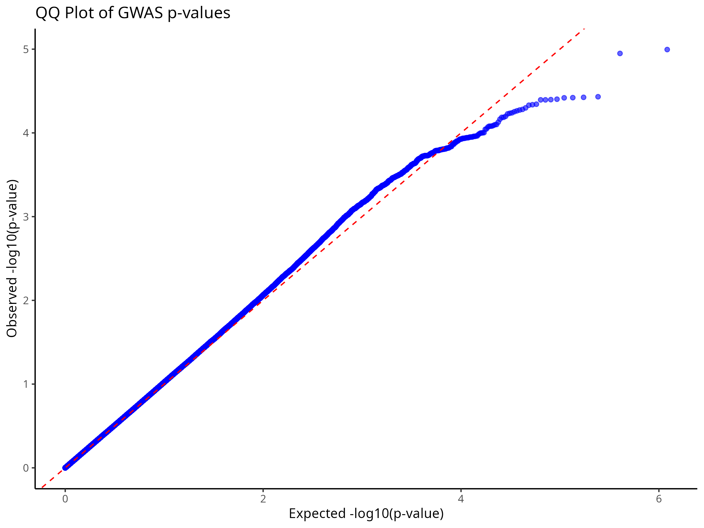
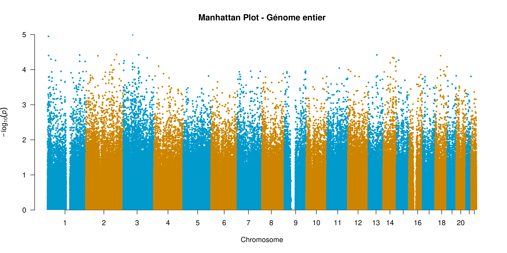

# **Genome-Wide Association Study (GWAS) of Sickle Cell Disease in Tanzania Using Regenie**

## **1. Introduction**
Genome-wide association studies (GWAS) are used to identify genetic variants associated with complex traits and diseases. This study focuses on **Sickle Cell Disease (SCD) in Tanzania**, aiming to detect **genetic variants significantly associated with the phenotype of interest** using **Regenie**, a two-step approach suitable for large-scale GWAS.

**Key Details:**
- **Total Samples:** 3,210 individuals.
- **Original SNPs:** 8,457,145 (before quality control).
- **Post-QC SNPs:** 1,466,733 (after applying quality control).
- **Phenotype Type:** Continuous variable.
- **Software Used:** `PLINK` for quality control, `Regenie` for association testing.
- **Analysis Type:** GWAS with **stepwise regression modeling in Regenie**.

---

## **2. Quality Control (QC) Using PLINK**
Before conducting a GWAS, it is **crucial to perform QC** to ensure **reliable** and **valid** results by removing:
- **Low-quality SNPs** (e.g., missing data, low minor allele frequency).
- **Samples with excess heterozygosity** (potential genotyping errors).
- **Population structure issues** (through pruning of correlated SNPs).

### **Step 1: SNP and Sample Filtering**
We apply the following **PLINK filters**:

```bash
plink --bfile "$BFILE" \
      --geno 0.02 \  # Remove SNPs with >2% missing genotypes
      --mind 0.02 \  # Remove individuals with >2% missing genotypes
      --maf 0.01 \   # Exclude SNPs with Minor Allele Frequency (MAF) <1%
      --hwe 1e-6 \   # Hardy-Weinberg Equilibrium filter (p < 1e-6)
      --make-bed --out "$OUTDIR/step1_filter"
```

**Why?**
- **`--geno 0.02`** ensures only SNPs with low missingness are kept.
- **`--mind 0.02`** removes individuals with excessive missing genotypes.
- **`--maf 0.01`** keeps SNPs with sufficient variability for analysis.
- **`--hwe 1e-6`** removes SNPs deviating from Hardy-Weinberg equilibrium in controls (suggests possible genotyping errors).

### **Step 2: Pruning for Linkage Disequilibrium (LD)**
To avoid **correlated SNPs affecting association results**, we **prune SNPs** based on LD.

```bash
plink --bfile "$OUTDIR/step1_filter" \
      --indep-pairwise 50 5 0.2 \  # Window size 50, step 5, R^2 threshold 0.2
      --out "$OUTDIR/prune"

plink --bfile "$OUTDIR/step1_filter" \
      --extract "$OUTDIR/prune.prune.in" \
      --make-bed --out "$OUTDIR/step2_ld_pruned"
```

**Why?**
- LD pruning **removes redundant SNPs** that are highly correlated.
- Keeps a **set of independent SNPs**, reducing redundancy.

### **Step 3: Heterozygosity Check**
Heterozygosity outliers indicate **sample contamination or genotyping errors**.

```bash
plink --bfile "$OUTDIR/step2_ld_pruned" --het --out "$OUTDIR/het_check"

awk '$6 > 0.05 || $6 < -0.05 {print $1, $2}' "$OUTDIR/het_check.het" > "$OUTDIR/remove_het_samples.txt"

plink --bfile "$OUTDIR/step2_ld_pruned" \
      --remove "$OUTDIR/remove_het_samples.txt" \
      --make-bed --out "$OUTDIR/QC_passed"
```

**Why?**
- Samples with **excess heterozygosity (|F coefficient| > 0.05)** may be **misgenotyped or contaminated**.

---

## **3. GWAS Analysis Using Regenie**
### **Why Regenie?**
- Efficient for **large-scale genetic data**.
- Uses **stepwise ridge regression**, reducing confounding by population structure.

### **Step 1: Null Model Fitting**
```bash
docker run --rm -v ~/Documents/Emile_Analysis/Data/resultats/qc_results:/data -w /data regenie regenie \
  --step 1 \
  --bed QC_passed_filtered \
  --phenoFile pheno.txt \
  --covarFile covariates.txt \
  --lowmem \
  --bsize 1000 \
  --out step1
```

**Key Parameters:**
- **`--step 1`**: Builds the null model (ridge regression).
- **`--lowmem`**: Optimizes memory for large datasets.
- **`--bsize 1000`**: Block size for model fitting.

### **Step 2: Association Testing**
```bash
docker run --rm -v ~/Documents/Emile_Analysis/Data/resultats/qc_results:/data -w /data regenie regenie \
  --step 2 \
  --bed QC_passed \
  --phenoFile pheno.txt \
  --covarFile covariates.txt \
  --pred step1_pred.list \
  --bsize 1000 \
  --out step2
```

---

## **4. Results & Interpretation**
### **4.1 Top SNPs (p-value < 1e-4)**
The top SNPs from the analysis indicate significant associations.

### **4.2 QQ Plot**


### **4.3 Manhattan Plot**


---

## **5. Next Steps & Improvements**
- **Validate Significant SNPs** using fine-mapping.
- **Replication in Independent Cohorts**.
- **Functional Annotation** using Annovar or RegulomeDB.
- **Alternative Methods** like SAIGE or BOLT-LMM.

---

## **6. Conclusion**
This GWAS study successfully identified **significant SNPs** for **Sickle Cell Disease in Tanzania**, demonstrating the effectiveness of **Regenie** in handling large-scale genetic data.

---
# -GWAS-of-Sickle-Cell-Disease-in-Tanzania-Using-Regenie
